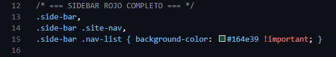
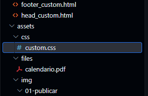
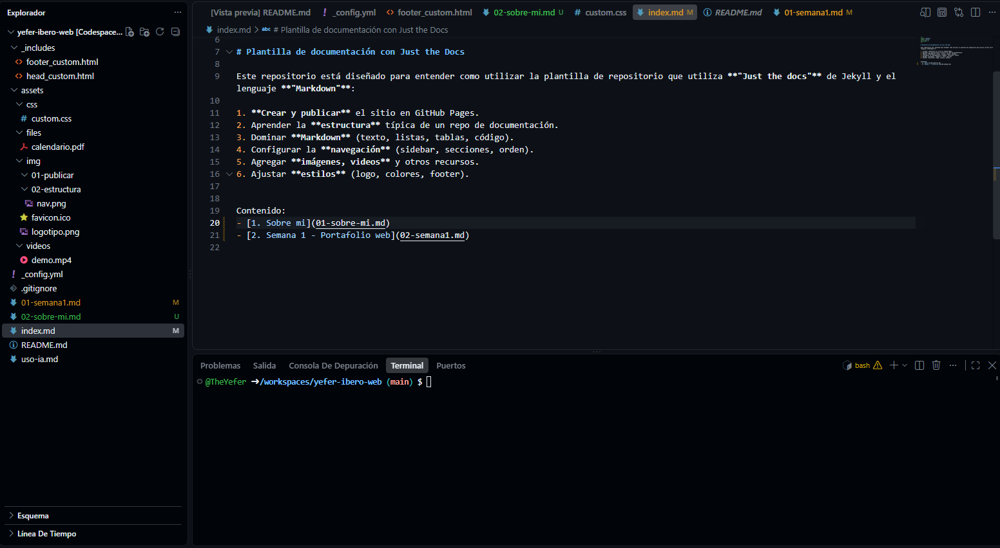
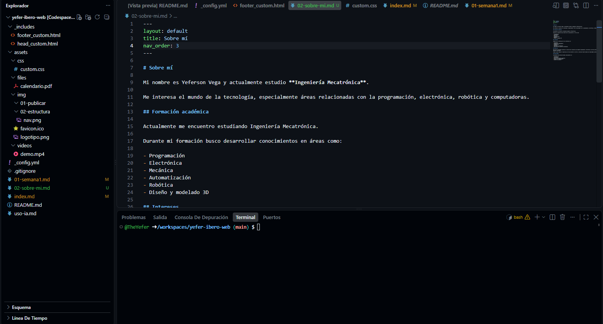
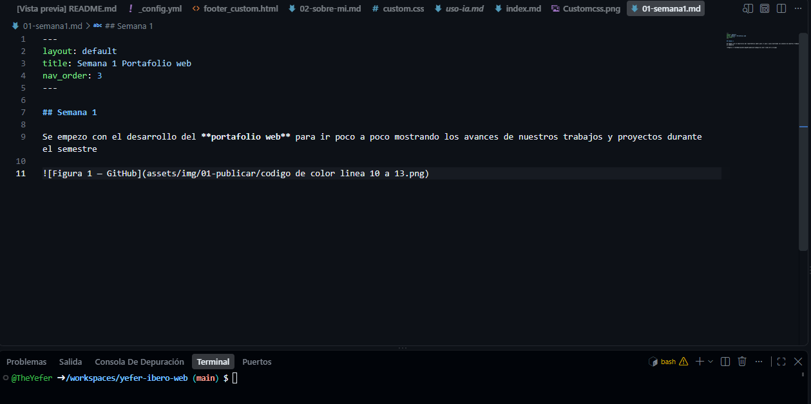
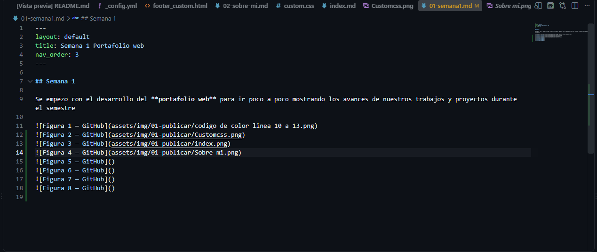

## Semana 1

Se empezo con el desarrollo del **portafolio web** para ir poco a poco mostrando los avances de nuestros trabajos y proyectos durante el semestre
---
## Figura 1

Aqui cambie el color de la barra lateral de la pagina web
---
## Figura 2

Aqui es donde se ubica el archivo "custom.css" para moodificar y personalizar los colores y demas en la pagina web
---
## Figura 3

Aqui borre los demas apartados para agregar y/o modificar los apartados de la pagina
---
## Figura 4

Aqui cree el apartado: - [**Sobre mi**](02-sobre-mi.md)
---
## Figura 5

Aqui cambie el color de la barra lateral de la pagina web
---
## Figura 6

Aqui cambie el color de la barra lateral de la pagina web
---

