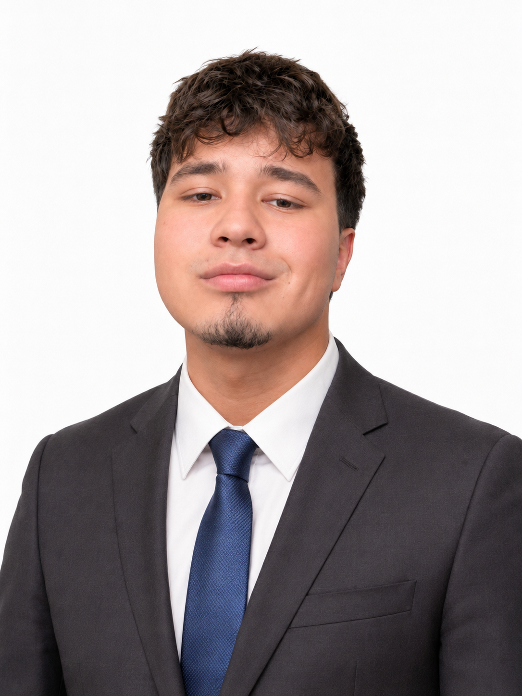

## Sobre mí

{: width="200" } Mi nombre es Yeferson Vega y actualmente estudio **Ingeniería Mecatrónica y Sistema Ciberfisicos** en la ibero.

<!-- foto de mi -->

Desde muy pequeño me intereso el mundo de la tecnología, especialmente áreas relacionadas con la programación, electrónica, robótica y especialmente computadoras.

## ¿Qué espero durante mi ormación académica?

Durante mi formación en la universidad busco desarrollar conocimientos en áreas como:

- Programación
- Electrónica
- Mecánica
- Automatización
- Robótica
- Diseño y modelado 3D

Aunque tambien me gustaria empezar a expandir mis conocimientos actuales a otros niveles que no pensaba conocer o llegar.

## Mis intereses

Algunos de los temas que más me interesan o me generan curiosidad son:

- Tecnología
- Hardware de computadoras
- Programación
- Robótica
- Inteligencia artificial
- Desarrollo de proyectos tecnológicos
- Maquinas automaticas
- Mecanica automotriz

## Mis objetivos

Uno de mis principales objetivos es desarrollar proyectos que combinen programación, electrónica, automatización y mecánica para resolver problemas con el uso avazando y etico de la tecnologia.
También quiero adquirir experiencia práctica durante mi carrera y continuar desarrollando mis habilidades de forma profesional en el futuro.

## Habilidades

Actualmente estoy desarrollando conocimientos en:

- Programación
- Electrónica
- Uso de herramientas digitales
- Hardware de computadoras
- Diseño de proyectos